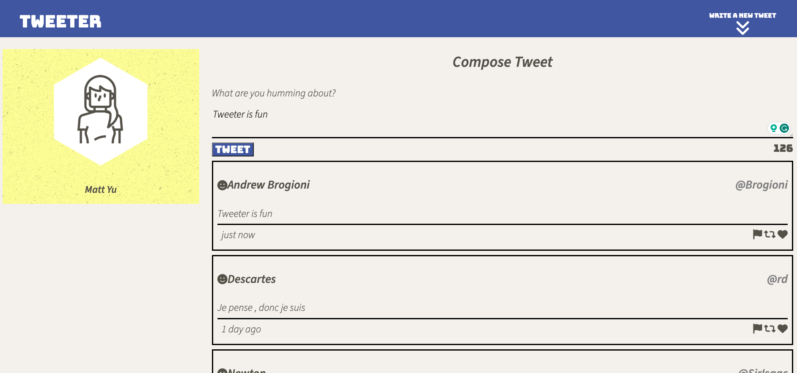
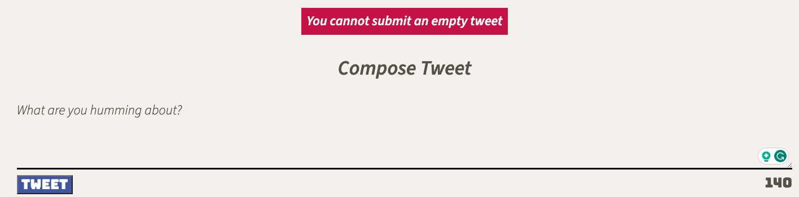
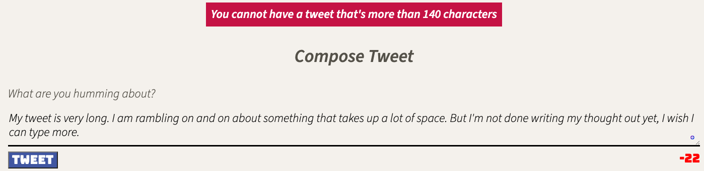

# Tweeter Project

Created as part of the Lighthouse Labs curriculum, created a simple Twitter clone where users can write a tweet in the text box, and their tweet will automatically refresh to the top of their timeline. 

## User Experience

Users can type whatever they like and their tweet will populate on the timeline. They have a limit of 140 characters, and users cannot submit an empty tweet.

When the user clicks on the tweet button, their tweet will be populated at the top of the timeline without requiring the page to refresh. 

Here is what the tweeter timeline looks like:

### **Errors**
If users submit an empty tweet or submit a tweet over 140 characters, they will be met with an error message. The error messages are shown below: 

## Dependencies
- Express
- Node 5.10.x or above
- Body-parser: v1.15.2
- Chance: v1.0.2
- md5: v2.1.0
- Timeago.js: v4.0.2
